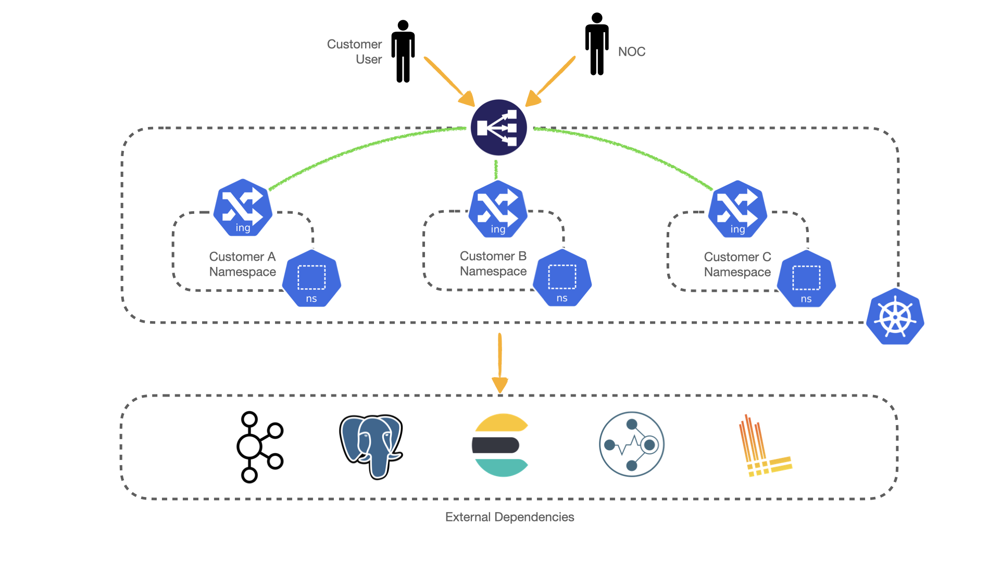
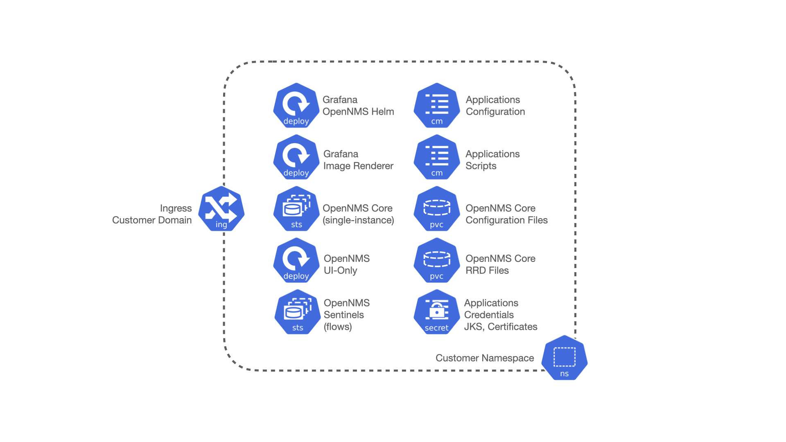
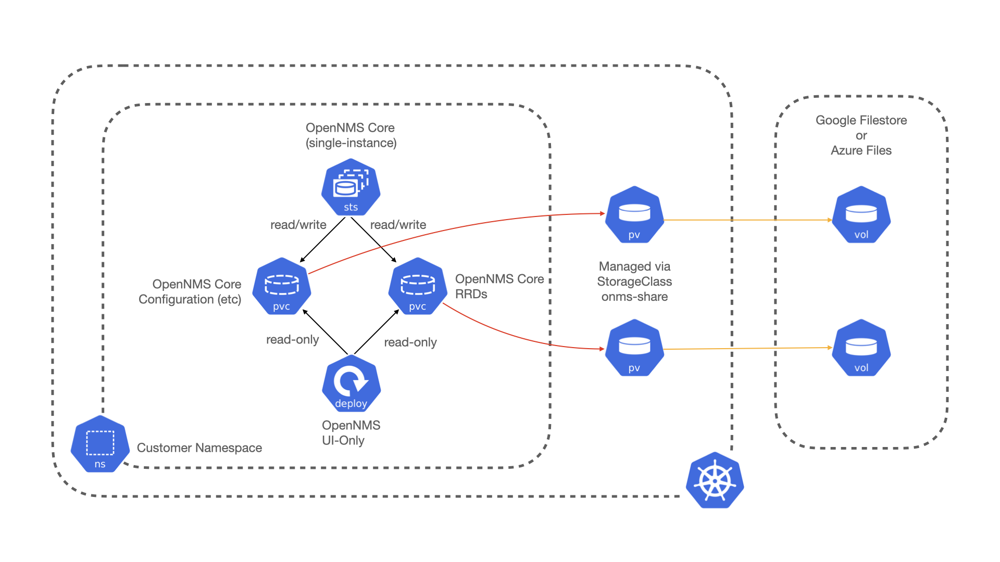

# OpenNMS K8s PoC

The objective of this project is to serve as a reference to implement [OpenNMS](https://www.opennms.com/) running in [Kubernetes](https://kubernetes.io/), deployed via [Helm](https://helm.sh/).

Each deployment would have a single Core Server, multiple read-only UI servers plus Grafana and a custom Ingress, sharing the RRD files and some configuration files, and Sentinels for flow processing.

Keep in mind that we expect Kafka, Elasticsearch, and PostgreSQL to run externally (and maintained separately from the solution), all with SSL enabled.

> *This is one way to approach the solution, without saying this is the only one or the best one. You should carefully study the content of this Helm Chart and tune it for your needs*.

**General Diagram**



**Customer Namespace Deployment Diagram**



**Shared Volumes Diagram**

The following describes the use case when having dedicated OpenNMS UI instances:



The above doesn't apply when creating an environment without UI instances, meaning the Helm Chart won't use the custom `StorageClass`. Instead, it assumes the usage of the default from your Kubernetes cluster. For example, on GKE, it is called `standard` and uses `kubernetes.io/gce-pd`.

## Requirements

* **Ensure you have a deep understanding of how Kubernetes and Helm works.**

### Local

* Have `kubectl` installed on your machine.

* Have `helm` version 3 installed on your machine.

* When using Cloud Resources, `az` for Azure, or `gcloud` for Google Cloud.

* Optionally, have `minikube` installed for testing purposes.

### For Kubernetes

* Use Kubernetes version 1.20 or newer.

* All components on a single `namespace` represent a single OpenNMS environment or customer deployment or a single tenant. The name of the `namespace` will be used as:
  * Customer/Deployment identifier.
  * The name of the deployed Helm application.
  * A prefix for the OpenNMS and Grafana databases in PostgreSQL.
  * A prefix for the index names in Elasticsearch when processing flows.
  * A prefix for the topics in Kafka (requires configuring the OpenNMS Instance ID on Minions).
  * A prefix for the Consumer Group IDs in OpenNMS and Sentinel.
  * Part of the sub-domain used by the Ingress Controller to expose WebUIs. It should not contain special characters and must follow FQDN restrictions.

* A single instance of OpenNMS Core (backend) for centralized monitoring running ALEC in standalone mode (if enabled).
  OpenNMS doesn't support distributed mode, meaning the `StatefulSet` cannot have more than one replica.

* [Optional] Multiple instances of read-only OpenNMS UI (frontend).
  * Must be stateless (unconfigurable).
  * The `Deployment` must work with multiple replicas.
  * Any configuration change goes to the core server.

* [Optional] Multiple instances of Sentinel to handle Flows (requires Elasticsearch as an external dependency).
  * When Sentinels are present, `Telemetryd` would be disabled on the OpenNMS Core instance.

* [Optional] A custom `StorageClass` for shared content (Google Filestore or Azure Files) to use `ReadWriteMany`.
  * Only required when having dedicated OpenNMS UI instances or when using the default RRD storage for time series data (not Cortex); otherwise, the default `StorageClass` is used (for example, for Google Cloud, it would be `standard` based on `kubernetes.io/gce-pd`.)
  * Use the same `UID` and `GID` as the OpenNMS image with proper file modes.
  * Due to how Google Filestore works, we need to specify `securityContext.fsGroup` (not required for Azure Files). Check [here](https://github.com/kubernetes-sigs/gcp-filestore-csi-driver/blob/master/docs/kubernetes/fsgroup.md) for more information.
  * Keep in mind that the minimum size of a Google Filestore instance is 1TB.
  * Keep in mind that a new PVC will be in place if the environment gets recreated, meaning new Filestore instances.

* A shared volume for the RRD files, mounted as read-write on the Core instance, and as read-only on the UI instances if applies.

* A shared volume for the core configuration files, mounted as read-only on the UI instances if applies.
  The purpose is to share configuration across all the OpenNMS instances (i.e., `users.xml`, `groups.xml`, among others).

* Multiple instances of Grafana (frontend), using PostgreSQL as the backend, pointing to the OpenNMS UI service when available.
  When UI instances are not present, the OpenNMS Helm data sources would point to the OpenNMS Core service.

* `Secrets` to store the credentials, certificates and truststores.

* `ConfigMaps` to store initialization scripts and standard configuration settings.

* An `Ingress` to control TLS termination and provide access to all the components (using Nginx).
  * You could manage certificates using LetsEncrypt via `cert-manager`, but we only requires the name of a `ClusterIssuer`.
  * To integrate with Google Cloud DNS managed zones or Azure DNS, we need a wild-card entry for the chosen domain against the IP of the Ingress Controller.

> **Please note that unless you build custom images for OpenNMS, the latest available version of the TSS Cortex Plugin (when enabled) as a KAR file will be downloaded directly from GitHub every time the OpenNMS Core container starts, as those binaries are not part of the current Docker image for OpenNMS.**

> **For the ALEC KAR plugin, the latest release will be fetched from GitHub like the TSS Cortex Plugin above unless `alecImage` is set, in which case it will be loaded from the specified Docker image.** See [alec/README.md](alec/README.md) for information on the Docker container.

### External Dependencies

* PostgreSQL server as the central database for OpenNMS and Grafana.
  * For Google Cloud, the solution was tested using Google SQL for PostgreSQL with SSL and a Private IP.

* Kafka cluster for OpenNMS-to-Minion communication.

* Elasticsearch cluster for flow persistence.

* Grafana Loki server for log aggregation.
  * [logcli](https://grafana.com/docs/loki/latest/getting-started/logcli/) helps extract OpenNMS logs from the command line for troubleshooting purposes.

* [Google Filestore](https://cloud.google.com/filestore) or [Azure Files](https://azure.microsoft.com/en-us/services/storage/files/) for the OpenNMS configuration and RRD files (managed by provider)
  * The documentation recommends 1.21 or later for the CSI driver.
  * Only applicable when using dedicated OpenNMS UI instances.

* Private Container Registry for custom Meridian Images (if applicable), in case OpenNMS Horizon is not an option.

* [cert-manager](https://cert-manager.readthedocs.io/en/latest/) to provide HTTPS/TLS support to the web-based services managed by the ingress controller.
  * A `ClusterIssuer` is required to use it across multiple independent OpenNMS installations.

* Nginx Ingress Controller, as the solution has not been tested with other Ingress implementaions.

## Ingress

The idea of using Ingress is to facilitate access to the OpenNMS UI and Grafana. That is not required, although it is a good thing to have. Indeed, you could modify the Helm Chart to avoid Ingress altogether (or make it optional) and expose the WebUIs via `LoadBalancer` or `NodePort` services, but that won't be covered here.

For example, when deploying the Helm Chart names `acme` (remember about the rules for the `namespace`) with a value of `k8s.agalue.net` for the `domain`, it would create an Ingress instance exposing the following resources via custom FQDNs:

- OpenNMS UI (read-only): `onms.acme.k8s.agalue.net`
- OpenNMS Core: `onms-core.acme.k8s.agalue.net`
- Grafana: `grafana.acme.k8s.agalue.net`

If you get a certificate error with Chrome in a local cluster because you don't have a valid certificate, see [thisisunsafe - Bypassing chrome security warnings](https://cybercafe.dev/thisisunsafe-bypassing-chrome-security-warnings/).

If you get a too many redirects error, try putting the path `/opennms/login.jsp` at the end of the OpenNMS UI URL to login. You might be running into problem related to [NMS-13901](https://issues.opennms.org/browse/NMS-13901).

To customize behavior, you could pass custom annotations via `ingress.annotations` when deploying the Helm Chart.

Please note that it is expected to have [cert-manager](https://cert-manager.io/docs/) deployed on your Kubernetes cluster as that would be used to manage the certificates (configured via `ingress.certManager.clusterIssuer`).

## Design

The solution is based and tested against the latest Horizon 29 and should work with Meridian 2021 and 2022. However, versions newer than that won't work without modifying the logic of the Helm Chart and initialization scripts.

Keep in mind that you need a subscription to use Meridian. In this case, you would have to build the Docker images and place them on a private registry to use Meridian with this deployment. Doing that falls outside the scope of this repository, but the main GitHub Repository for OpenNMS offers a [guide](https://github.com/OpenNMS/opennms/tree/master/opennms-container) that you could use as a reference.

Due to how the current Docker Images were designed and implemented, the solution requires multiple specialized scripts to configure each application properly. You could build your images and move the logic from the scripts executed via `initContainers` to your custom entry point script and simplify the Helm Chart. 

The scripts configure only a certain number of things. Each deployment would likely need additional configuration, which is the main reason for using a Persistent Volume for the Configuration Directory of the Core OpenNMS instance.

We must place the core configuration on a PVC configured as `ReadWriteMany` to allow the usage of independent UI servers so that the Core can make changes and the UI instances can read from them. Unfortunately, this imposes some restrictions on the chosen cloud provider. For example, in Google Cloud, you would have to use [Google Filestore](https://cloud.google.com/filestore), which cannot have volumes less than 1TB, exaggerated for what the configuration directory would ever have (if UI servers are required). In contrast, that's not a problem when using [Azure Files](https://azure.microsoft.com/en-us/services/storage/files/), which has more flexibility than Google Filestore. The former exposes the volumes via SMB or NFS with essentially any size, whereas the latter only uses NFS with size restrictions.

One advantage of configuring that volume is allowing backups and access to the files without accessing the OpenNMS instances running in Kubernetes.

The reasoning for the UI servers is to alleviate the Core Server from ReST and UI-only requests. Unfortunately, this makes the deployment more complex. It is a trade-off you would have to evaluate. Field tests are required to decide whether or not this is needed and how many instances would be required.

The UI servers need to access multiple files from the Core server to serve multiple requests (including the ReST API). For this reason, a solution based on symlinks is in place via the initialization scripts. Also, to reduce the complexity, the UI servers are forced to be read-only, meaning even users with `ROLD_ADMIN` cannot make any changes (not even through ReST). You should apply any configuration change via the Core Instance.

Similarly, when using RRDtool instead of Newts/Cassandra or Cortex, a shared volume with `ReadWriteMany` is required for the same reasons (the Core would be writing to it, and the UI servers would be reading from it). Additionally, when switching strategies and migration are required, you could work outside Kubernetes.

Please note that the volumes would still be configured that way even if you decide not to use UI instances; unless you modify the logic of the Helm Chart.

To alleviate load from OpenNMS, you can optionally start Sentinel instances for Flow Processing. That requires having an Elasticsearch cluster available. When Sentinels are present, Telemetryd would be disabled in OpenNMS.

The OpenNMS Core and Sentinels would be backed by a `StatefulSet` but keep in mind that there can be one and only one Core instance. To have multiple Sentinels, make sure to have enough partitions for the Flow topics in your Kafka clusters, as all of them would be part of the same consumer group.

The current OpenNMS instances are not friendly when accessing log files. The Helm Chart allows you to configure [Grafana Loki](https://grafana.com/oss/loki/) to centralize all the log messages. When the Loki server is configured, the Core instance, the UI instances, and the Sentinel instances will be forwarding logs to Loki. The current solution uses the sidecar pattern using [Grafana Promtail](https://grafana.com/docs/loki/latest/clients/promtail/) to deliver the logs.

All the Docker Images can be customizable via Helm Values. The solution allows you to configure custom Docker Registries to access your custom images, or when all the images you're planning to use won't be in Docker Hub or your Kubernetes cluster won't have Internet Access. Please keep in mind that your custom images should be based on those currently in use.

If you plan to use the TSS Cortex plugin, the current solution will download the KAR file from GitHub every time the containers start. If your cluster doesn't have Internet access, you must build custom images with the KAR file.

For the ALEC KAR plugin, the latest release will be fetched from GitHub like the TSS Cortex Plugin above unless `alecImage` is set, in which case it will be loaded from the specified Docker image.

Also, the Helm Chart assumes that all external dependencies are running somewhere else. None of them would be initialized or maintained here. Those are Loki, PostgreSQL, Elasticsearch, Kafka and Cortex (when applies). There is a script provided to startup a set of dependencies for testing as a part of the same cluster but **this is not intended for production use.**

## Run in the cloud

The following assumes that you already have an AKS or GKE cluster up and running with [Nginx Ingress](https://kubernetes.github.io/ingress-nginx/) Controller and [cert-manager](https://cert-manager.io/docs/) (with a `ClusterIssuer` available for the Ingress), and `kubectl` is correctly configured on your machine to access the cluster.

At a minimum, the cluster should have three instances with 4 Cores and 16GB of RAM on each of them.

> **Place the Java Truststore with the CA Certificate Chain of your Kafka cluster, your Elasticsearch cluster, and your PostgreSQL server/cluster on a JKS file located at `jks/truststore.jks`, and also the Root CA used for your PostgreSQL server certificate on a PKCS12 file located at `jks/postgresql-ca.crt`. Then, pass them to OpenNMS via Helm (set the JKS password or update the values file).**

When using Google Cloud, ensure that `GcpFilestoreCsiDriver` is enabled in your GKE Cluster, if not, you can enabled it as follow (according to the [documentation](https://cloud.google.com/kubernetes-engine/docs/how-to/persistent-volumes/filestore-csi-driver)):

```bash
gcloud container clusters update CLUSTER_NAME_HERE \
  --update-addons=GcpFilestoreCsiDriver=ENABLED
```

It is advised to have the dependencies outside this Kubernetes cluster, but for testing purposes, you can use `start-dependencies.sh` to initialize all the dependencies in Kubernetes with a basic configuration (including `cert-manager`).

If you use `start-dependencies.sh`, you will need to edit `dependencies/kafka.yaml` first and set the bootstrap and broker hostnames for Kafka to match your cluster names. You can then use the following script to initialize the dependencies for testing:

```bash
./start-dependencies.sh
```

If you're planning to have dedicated UI instances or are using the default RRD storage for time series (not Cortex), create the Storage Class in Google Cloud, using `onms-share` as the name of the `StorageClass`:

```bash
./create-storageclass.sh gke onms-share
```

For Azure, replace `gke` with `aks`. On GKE, please keep in mind that it uses the standard tier and the default network/VPC. Refer to Google's documentation to use a custom network/VPC. On Azure, it uses `Standard_LRS`. Similarly, additional cases require updating the above script.

> The custom storage class is ignored if `opennms.uiServers.replicaCount` is equal to `0` (the default behavior).

Start the OpenNMS environment on your Kubernetes cluster in the cloud using Helm:

```bash
helm upgrade --install -f helm-cloud.yaml \
  --set domain=k8s.agalue.net \
  --set storageClass=onms-share \
  --set ingress.certManager.clusterIssuer=opennms-issuer \
  --set-file dependencies.truststore.content=jks/truststore.jks \
  --set-file dependencies.postgresql.ca_cert=jks/postgresql-ca.crt \
  --set dependencies.postgresql.hostname=onms-db.shared.svc \
  --set dependencies.kafka.hostname=onms-kafka-bootstrap.shared.svc \
  --set dependencies.elasticsearch.hostname=onms-es-http.shared.svc \
  apex1 ./opennms
```

> Please note that `apex1` uniquely identifies the environment. As mentioned, that word will be used as the namespace, the OpenNMS Instance ID, and prefix the `domain` for the FQDNs used in the Ingress Controller, among other things. Ensure to use the correct domain, hostname for your dependencies, name for the `StorageClass` that allows `ReadWriteMany` (if needed), the `ClusterIssuer` to create certificates for the hosts managed by the Ingress, and all the credentials.

> Make sure to use your domain.

> Make sure to adjust `helm-cloud.yaml` to your needs. You could avoid using `--set` if all the values are correct on the values file. Using `--set` overrides what's passed via `-f`, which in turn overrides the Chart defaults (`values.yaml`, or the output of `helm show values ./opennms`).

Keep in mind the above is only an example. You must treat the content of [helm-cloud.yaml](helm-cloud.yaml) as a sample for testing purposes. Make sure to tune it properly (that way, you could avoid overriding settings via `--set`).

To access the cluster from external Minions, make sure to configure the DNS service correctly on your cloud provider. Depending on the version you would need access not only to Kafka but also to the ReST API of the Core OpenNMS instance.

To test Ingress access, you must configure a wildcard DNS entry for the chosen domain on your registrar, pointing to the public IP of the Ingress Controller, obtained as follow:

```bash
kubectl get svc ingress-nginx-controller -n ingress-nginx \
  -o jsonpath='{.status.loadBalancer.ingress[0].ip}'
```

### Test Meridian in Google Cloud

We recommend reviewing the [documentation](https://cloud.google.com/artifact-registry/docs/integrate-gke) for Google Artifact Registry. From there, you can see that there is no need to set up `imagePullSecrets` when using recent versions of GKE, even if the registry and the GKE cluster are on different projects (although in that case, some you need to configure some permissions).

That means, once the images are available, you can just set the `opennms.image.repository` and `opennms.image.tag` appropriately (same for Sentinel), and that's it when deploying OpenNMS via Helm.

To create a registry:

```bash
gcloud artifacts repositories create opennms \
  --repository-format=docker \
  --location=us-east1 \
  --description="Docker Repository for OpenNMS Images"
```

Then, configure Docker:

```bash
gcloud auth configure-docker us-east1-docker.pkg.dev
```

> Note that the location/region must match.

Upload Meridian Images:

```bash
docker image load -i ~/Downloads/meridian.oci
docker image load -i ~/Downloads/sentinel.oci
```

Tag and upload images to the Artifact Registry:

```bash
PROJECT_NAME="OpenNMS"
PROJECT_ID=$(gcloud projects list | grep $PROJECT_NAME | awk '{print $1}')
REGISTRY_PATH="us-east1-docker.pkg.dev/$PROJECT_ID/opennms"

docker image tag meridian:latest $REGISTRY_PATH/meridian:M2021
docker image push $REGISTRY_PATH/meridian:M2021

docker image tag meridian-sentinel:latest $REGISTRY_PATH/meridian-sentinel:M2021
docker push $REGISTRY_PATH/meridian-sentinel:M2021
```

> Note that the name of the repository must match, and ensure to use the appropriate Project ID.

Finally, install Meridian via Helm:

```
helm upgrade --install -f helm-cloud.yaml \
  --set opennms.image.repository=$REGISTRY_PATH/meridian \
  --set opennms.image.tag=M2021 \
  --set sentinel.image.repository=$REGISTRY_PATH/meridian-sentinel \
  --set sentinel.image.tag=M2021 \
  --set domain=k8s.agalue.net \
  --set storageClass=onms-share \
  --set ingress.certManager.clusterIssuer=opennms-issuer \
  --set-file dependencies.truststore.content=jks/truststore.jks \
  --set-file dependencies.postgresql.ca_cert=jks/postgresql-ca.crt \
  --set dependencies.postgresql.hostname=onms-db.shared.svc \
  --set dependencies.kafka.hostname=onms-kafka-bootstrap.shared.svc \
  --set dependencies.elasticsearch.hostname=onms-es-http.shared.svc \
  apex1 ./opennms
```

> Note the usage of the same `REGISTRY_PATH` created before.

## Run locally for testing purposes

Start Minikube:

```bash
minikube start --cpus=4 --memory=24g \
  --addons=ingress \
  --addons=ingress-dns \
  --addons=metrics-server \
  --addons=registry \
  --insecure-registry "10.0.0.0/24"
```

It is advised to have the dependencies outside this Kubernetes cluster, but for testing purposes, you can use `start-dependencies.sh` to initialize all the dependencies in Kubernetes with a basic configuration (including `cert-manager`).

If you use `start-dependencies.sh`, you will need to edit `dependencies/kafka.yaml` first and set the bootstrap and broker hostnames for Kafka to match your cluster names. You can then use the following script to initialize the dependencies for testing:

```bash
./start-dependencies.sh
```

If you're planning to have dedicated UI instances or if you are using the default RRD storage for time series (not Cortex), create the storage class (this must be done once):

```bash
./create-storageclass.sh minikube onms-share
```

> The custom storage class is ignored if `opennms.uiServers.replicaCount` is equal to `0` (the default behavior).

Start OpenNMS with Sentinel and a UI server:

```bash
helm upgrade --install -f minimal-resources.yaml \
  --set domain=k8s.agalue.net \
  --set storageClass=onms-share \
  --set-file dependencies.truststore.content=jks/truststore.jks \
  --set-file dependencies.postgresql.ca_cert=jks/postgresql-ca.crt \
  apex1 ./opennms
```

Take a look at the documentation of [ingress-dns](https://github.com/kubernetes/minikube/tree/master/deploy/addons/ingress-dns) for more information about how to use it, to avoid messing with `/etc/hosts`.

For instance, for macOS:

```bash
DOMAIN="k8s.agalue.net"

sudo mkdir -p /etc/resolver
cat <<EOF | sudo tee /etc/resolver/$DOMAIN
domain $DOMAIN
nameserver $(minikube ip)
EOF
```

> Even if the above is running on your machine, please use your own domain.

### Test Meridian in Minikube

As OpenNMS doesn't publish Meridian Images to Docker Hub as using Meridian requires a subscription, you can try the following, assuming you built the images and generated OCI files. Note that we started `minikube` with the `registry` addon.

First, upload Meridian Images:

```bash
minikube image load ~/Downloads/meridian.oci
minikube image load ~/Downloads/sentinel.oci
```

Then, SSH into the Minikube VM:

```bash
minikube ssh
```

Within the Minikube VM, tag and upload the images to the local registry:

```bash
docker image tag meridian:latest localhost:5000/meridian:M2021
docker image push localhost:5000/meridian:M2021

docker image tag meridian-sentinel:latest localhost:5000/meridian-sentinel:M2021
docker push localhost:5000/meridian-sentinel:M2021
```

Optionally, you can verify they are present there:

```bash
$ curl http://localhost:5000/v2/_catalog
{"repositories":["meridian","meridian-sentinel"]}
```

Finally, install Meridian via Helm:

```
helm upgrade --install -f minimal-resources.yaml \
  --set opennms.image.repository=localhost:5000/meridian \
  --set opennms.image.tag=M2021 \
  --set opennms.image.pullPolicy=Never \
  --set sentinel.image.repository=localhost:5000/meridian-sentinel \
  --set sentinel.image.tag=M2021 \
  --set sentinel.image.pullPolicy=Never \
  --set domain=k8s.agalue.net \
  --set storageClass=onms-share \
  --set-file dependencies.truststore.content=jks/truststore.jks \
  --set-file dependencies.postgresql.ca_cert=jks/postgresql-ca.crt \
  apex1 ./opennms
```

The above proves that the Helm Chart works with M2021 and Horizon 29 (the reference implementation).

To test Minion, you can use the publicly available [meridian-minion](https://hub.docker.com/repository/docker/opennms/meridian-minion) image, for instance:

```bash
./start-minion.sh --minion_repository opennms/meridian-minion --minion_version 2021.1.8
```

## Testing multiple OpenNMS environments

The current approach allows you to start multiple independent OpenNMS environments using the same Helm Chart. Ensure the deployment name is different every time you install or deploy a new environment (as mentioned, used for the namespace and the OpenNMS instance ID, among other things).

> Remember to change all username/password pairs for each environment to increase security.

## Start an external Minion

The [start-minion.sh](start-minion.sh) script is designed for the test use case. To tune it for your use case, you can alter all all its internal variables with argument flags, for instance:

```bash
./start-minion.sh \
  --instance_id Texas \
  --minion_id minion01 \
  --minion_location Houston \
  --kafka_boostrap kafka1.example.com:9092
```

Check the script for more details.

## Problems/Limitations

* The WebUI sends events handled by Queued to promote updating RRD files to ensure data is available. That won't work with dedicated UI servers (as Queued is not running there).
* When using Newts, the resource cache won't exist on the UI servers (maintained by Collectd), meaning all requests will hit Cassandra, slowing down the graph generation. The same applies when using Grafana via the UI servers.
* Using Google Filestore or Azure Files might impact performance, so make sure to perform various field tests (you'll find a dedicated section for this topic later).

## Manual configuration changes

* Either access the OpenNMS container via a remote shell through `kubectl`, and edit the file using `vi` (the only editor available within the OpenNMS container), or mount the NFS share from Google Filestore or Azure Files from a VM or a temporary container and make the changes.
* Send the reload configuration event via `send-event.pl` or the Karaf Shell (not accessible within the container).
* In case OpenNMS has to be restarted, delete the Pod (not the StatefulSet), and Kubernetes controller will recreate it again.

## RRDtool performance on Google Filestore

Using the `metrics-stress` command via Karaf Shell, emulating 1500 nodes and persisting 5000 numeric metrics per second (and 200 string attributes per second), the solution seems to stabilize around 5 minutes after having all the RRD files created (which took about 10 minutes after starting the command).

Enable port forwarding to access the Karaf Shell:

```bash
kubectl port-forward -n apex1 onms-core-0 8101
```

> Ensure to use the appropriate namespace.

From a different console, start the Karaf Shell:

```bash
ssh -o ServerAliveInterval=10 -p 8101 admin@localhost
```

Then,

```
opennms:stress-metrics -r 60 -n 1500 -f 20 -g 1 -a 50 -s 2 -t 100 -i 300
```

For RRDtool, you could pass a list of RRAs to test specific scenarios, for instance:

```
opennms:stress-metrics -r 60 -n 1500 -f 20 -g 1 -a 50 -s 2 -t 100 -i 300 -x RRA:AVERAGE:0.5:1:4032 -x RRA:AVERAGE:0.5:12:1488 -x RRA:AVERAGE:0.5:288:366 -x RRA:MAX:0.5:288:366 -x RRA:MIN:0.5:288:366
```

Google's Metric Explorer showed that Filestore writes were around 120 MiB/sec on average while the files were being created. After that, it decreased to about ten times less the initial throughput.

Note that at 5 minutes collection interval, persisting 5000 metrics per second implies having 1.5 million unique metrics.
